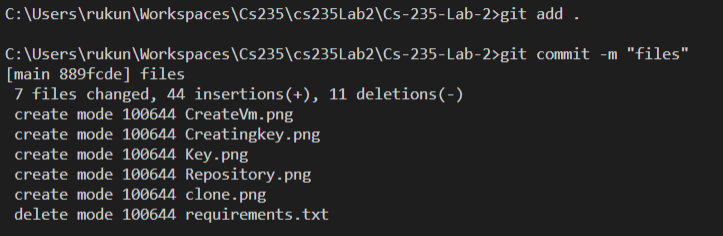
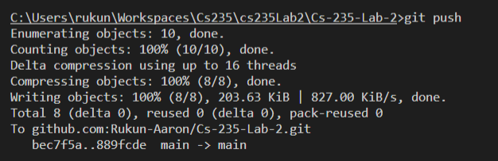
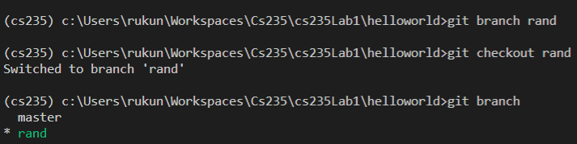
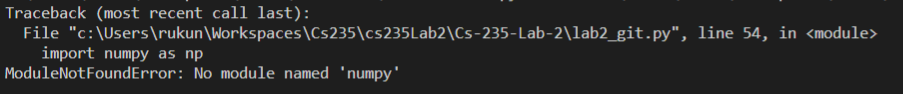
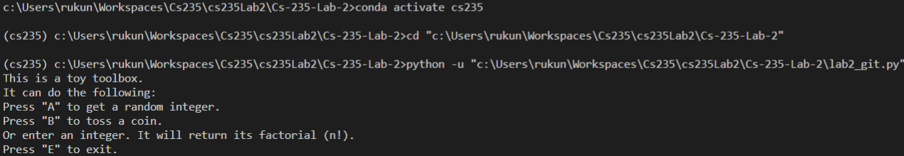
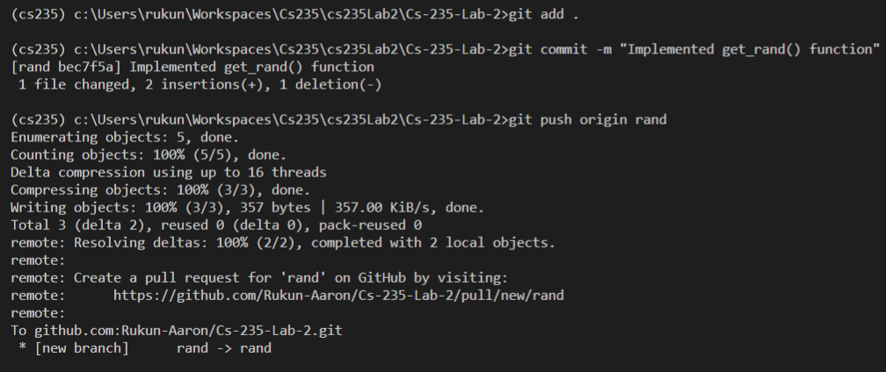
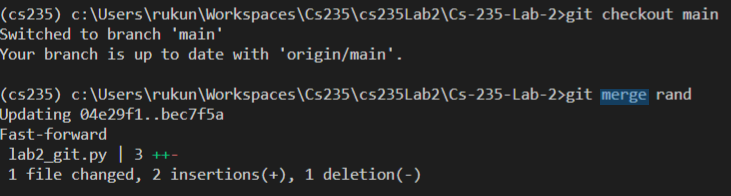
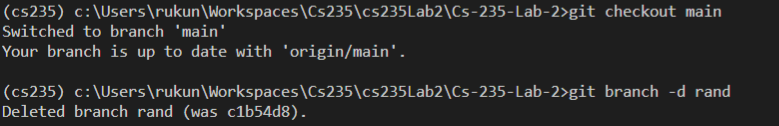

# CS 235 Lab 2 report 
##### Name : Rukun Aaron , Upi = raar518
## Sections

  - [Notes](#what-is-git)
  - [Reflection](#reflection)
  - [Tasks](#Student-A-Tasks)
---
## **What is git?**

- **Git the most popular version control system in the world**
  </br>
  - It record the changes made to our code over type in a database, known as a repository.  
  </br>

- **Instead of manually saving version of a software, git allows us to verision code by doing the following:**
  - Creating a repository  using following command (in our desired repository):   
  ```git
    git init
  ```
  
  - Or going on github (a repository hosting service) and creating a repository and cloning to your local machine using: 
  ```git
  Cloning with HTTPS URLS :
  git clone  https://github.com/Username/Your-Repository.git
  ```
  ```git 
  Cloning with SSH over the HTTPS port
  git clone git@github.com:Username/Your-Repository.git
  ```
  - Add a branch to make your changes:
  ```git
  Create a branch using:
  git branch <branch_name>
  
  Switch to the newly created branch:
  git checkout <branch_name>
  ```
  - After adding our changes we  push the branch to the remote repository:
  ```git
  Stage all changes using:
  git add .

  Commit the changes and write a message using:
  git comming -m <Message>

  Update the remote repository on github using: 
  git push origin <branch_name>

  Merge the new branch with the main/master branch:
  git checkout main
  git merge <branch_name>

 ## What is SSH and why do we use it when using GitHub
  - **Github does not accept accept password to authenticate git commands; hence we use SSH to use to verify your identity**. 
  <br></br>
    1. We created a pair of SSH key doing the following:
    <br></br>

        
    
    2. Then I uploaded my public key to my GitHub:
    <br></br>
        

---

## **Reflection**
**What I learnt:**

  - I learnt various about various features of Git and Github which include:
    - Creating a repository
    - Cloning a repository
    - How to create a branch 
    - How to push changes and merge branch
    - What forking is and how to create pull requests. 
    - How to generate and add SSH keys to GitHub
---
## **Student A Tasks:**
  1. **Create a repository on GitHub and clone it:**

      
      
  
  2. **Activating a virtual environment, generating a requirements file and adding the [startup project](Cs-235-Lab-2/lab2_git.py) to the repository:**

      
  
  3. **Stage and commit changes to the main branch of the repository** 
          
       - **Staged and commited files :**

        
        
      - **Pushed changes to the remote repo**
        
         
  
  4. **Create a new branch, modify the code on the branch and merge changes:**

      - **Creating and switching to branch rand:**

        
      
      - **I implemented the getRand() function in the rand branch:**
        ```python
          def get_rand():
      
          my_randint = np.random.randint(0, 100)
          return my_randint
          ```
        - Initally I wasn't able to run my code because the interpreter count find a module calle numpy.

          

        - The reason for this is because I wasn't working in the virtual environement where I had previously downloaded numpy. So after activating the environment I was able to run my code:
          
       
      - **Then I staged, commit and pushed it to the remote repository**:

        
      
      - **Then I merged it with my main branch**
        
        I resolved a merge conflict I encountered but managed to resolve it and push my changes.  
      
        

  5. **Delete Branch** 

      I delete the branch using:

        
  
  6. **Answer the following questions**
    
    Question 1:

    In a scenario, where you work with others as a team. You wrote some code 
    using the lab machine, but the code isn't working. You decide to continue 
    working on the code from home. What's the best way to commit your unfinished code
    to GitHub without interrupt others? What commands do you need to achieve that?

    Answer:
    The best way to commit the unfinished code to GitHub is by creating and publishing your changes to new temporary branch that is seperate from the main / branch development was occuring on.

    Question 2:

    Explain the difference between merge and fork. Give an example for each use case.
    
    Answer: 

    Merging is the way that Git & GitHub merges two seperate deveopment histories into one. Ussually Usually when developing software, there are multiple branches that team members work on to fix bugs, add new features etc; when one of these features is ready to be added to the main branch, the feature branch and the main branch are merged together. Merging is mostly done between branches, but can also be done between repositories. 


    Forking is the act of "forking" a copy of someones repository onto your account, this allows you to, after cloning it,  make any changes to the repository without effecting the original repository. After making your changes, you can create a pull request  to the owner to merge your changes with the original repo.
  
  
