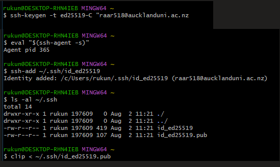
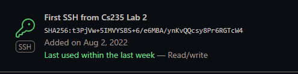
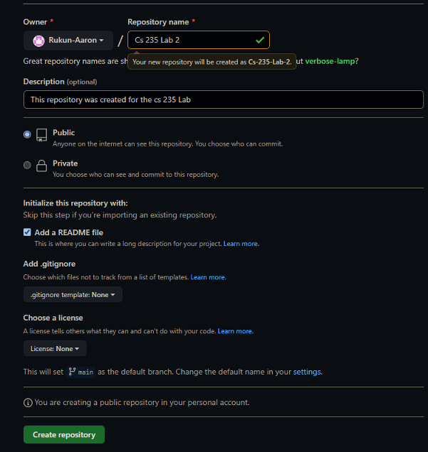
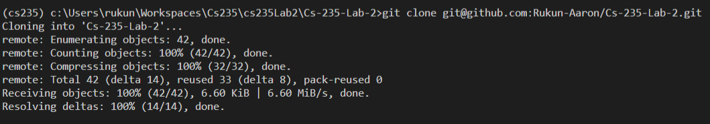
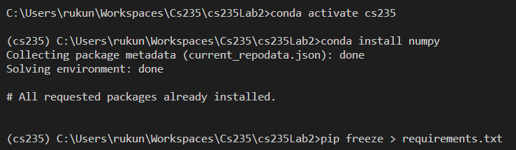

# CS 235 Lab 2 report 
##### Name : Rukun Aaron , Upi = raar518
## Sections

  - [Notes](#what-is-git)
  - [Reflection](#reflection)
  - [Tasks](#4-debugging-questions-and-exercises)
---
## **What is git?**

- **Git the most popular version control system in the world**
  </br>
  - It record the changes made to our code over type in a database, known as a repository.  
  </br>

- **Instead of manually saving version of a software, git allows us to verision code by doing the following:**
  - Creating a repository  using following command (in our desired repository):   
  ```git
    git init
  ```
  
  - Or going on github (a repository hosting service) and creating a repository and cloning to your local machine using: 
  ```git
  Cloning with HTTPS URLS :
  git clone  https://github.com/Username/Your-Repository.git
  ```
  ```git 
  Cloning with SSH over the HTTPS port
  git clone git@github.com:Username/Your-Repository.git
  ```
  - Add a branch to make your changes:
  ```git
  Create a branch using:
  git branch <branch_name>
  
  Switch to the newly created branch:
  git checkout <branch_name>
  ```
  - After adding our changes we  push the branch to the remote repository:
  ```git
  Stage all changes using:
  git add .

  Commit the changes and write a message using:
  git comming -m <Message>

  Update the remote repository on github using: 
  git push origin <branch_name>

  Merge the new branch with the main/master branch:
  git checkout main
  git merge <branch_name>

 ## What is SSH and why do we use it when using GitHub
  - **Github does not accept accept password to authenticate git commands; hence we use SSH to use to verify your identity**. 
  <br></br>
    1. We created a pair of SSH key doing the following:
    <br></br>

        
    
    2. Then I uploaded my public key to my GitHub:
    <br></br>
        

---

## **Reflection**
**What I learnt:**

  - I learnt various about various features of Git and Github which include:
    - Creating a repository
    - Cloning a repository
    - How to create a branch 
    - How to push changes and merge branch
    - What forking is and how to create pull requests. 
    - How to generate and add SSH keys to GitHub
---
## **Hands on tasks (Student A):**
  1. Create a repository on GitHub and clone it:

      
      
  
  2. Activating a virtual environment, generating a requirements file and adding the [startup project](Cs-235-Lab-2/lab2_git.py) to the repository:

      
  
  3. 
        